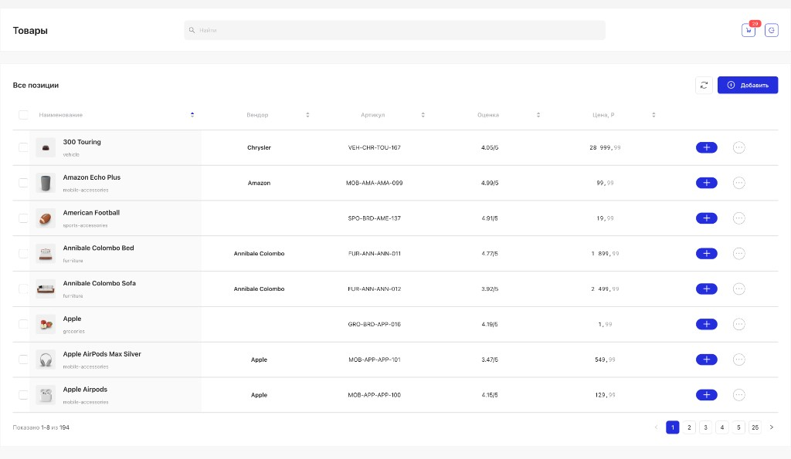

# Goods Example

React + TypeScript application built with Feature Sliced Design, Zustand, Ant Design, and TanStack Query. Uses [DummyJSON](https://dummyjson.com) for Products and Auth APIs.



## Project Structure

```
src/
├── app/                    # App initialization, providers, theme
│   ├── App.tsx
│   ├── providers/
│   └── theme.ts
├── pages/                  # Route-level pages
│   ├── login/
│   └── products/
├── widgets/                # Composite UI blocks
│   ├── login-form/
│   └── product-list/
├── features/               # User interactions & business features
│   ├── add-product/
│   ├── auth/
│   └── cart/
├── entities/               # Business entities
│   ├── cart/
│   └── product/
├── shared/                 # Shared utilities, API, styles
│   ├── api/
│   ├── lib/
│   ├── locale/
│   └── styles/
├── test/                   # Test setup and utilities
│   ├── setup.ts            # Vitest setup (jest-dom, matchMedia mock)
│   └── test-utils.tsx      # Custom render with providers
└── main.tsx
```

The structure follows [Feature Sliced Design](https://feature-sliced.design/) — each slice (entities, features, widgets, pages) can contain `ui/`, `model/`, `api/` subfolders.

## Prerequisites

- **Node.js** 18+ (20+ recommended)
- npm

## Setup

```bash
npm install
npm run dev
```

Open http://localhost:5173

## Routes

| Path | Description |
|------|-------------|
| `/` | Products page (protected) |
| `/login` | Login page |
| `*` | Redirects to `/` |

## Scripts

| Command | Description |
|---------|-------------|
| `npm run dev` | Start development server |
| `npm run build` | Build for production |
| `npm run preview` | Preview production build locally |
| `npm test` | Run tests in watch mode |
| `npm run test:run` | Run tests once (CI-friendly) |
| `npm run lint` | Run ESLint |

## Tests

### Running Tests

```bash
# Run tests in watch mode (re-runs on file changes)
npm test

# Run tests once (CI-friendly)
npm run test:run
```

### Test Structure

- Tests are **colocated** with source files: `ComponentName.test.tsx` or `module.test.ts`
- Test glob: `src/**/*.{test,spec}.{ts,tsx}`
- Stack: **Vitest** + **jsdom** + **Testing Library** (React, user-event)

### Writing Tests

1. **React components** — use custom `render` from `@/test/test-utils` (includes QueryClient, Router):

   ```tsx
   import { render, screen } from '@/test/test-utils';
   import { MyComponent } from './MyComponent';

   it('renders correctly', () => {
     render(<MyComponent />);
     expect(screen.getByRole('button')).toBeInTheDocument();
   });
   ```

2. **Units / API / stores** — import from `vitest` directly:

   ```ts
   import { describe, expect, it, vi } from 'vitest';
   ```

3. **Setup** (`src/test/setup.ts`) — adds `@testing-library/jest-dom` matchers and mocks `window.matchMedia` for Ant Design.

## Login

Use any credentials from [DummyJSON Users](https://dummyjson.com/users), for example:

- **Username:** `emilys`
- **Password:** `emilyspass`

## Features

- **Login form** with validation, error handling, and "Запомнить данные" (remember me) — session stored in `localStorage` (persists) or `sessionStorage` (clears on tab close)
- **Protected products page** — redirects to login when not authenticated
- **Product list** with loading progress bar, sortable columns (persisted), search, pagination
- **Rating &lt; 3** highlighted in red
- **Add product** modal — form with Name, Price, Vendor, SKU; mock success with toast notification

## Tech Stack

- React 18, TypeScript, Vite
- Feature Sliced Design
- Zustand, TanStack Query
- Ant Design (Russian locale `ru_RU`)
- React Router
